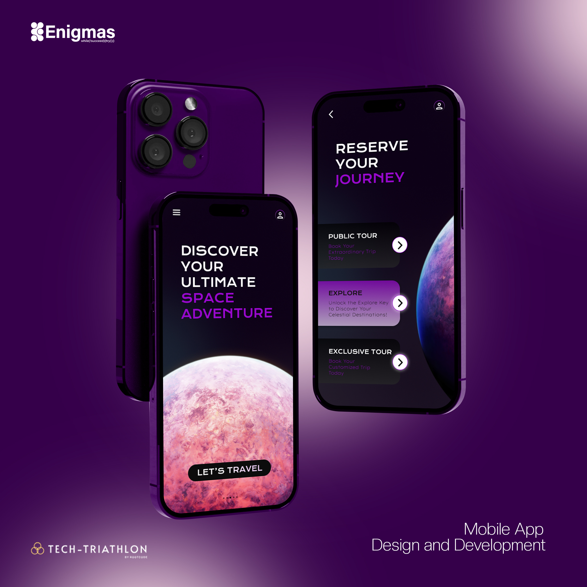

# Rootcode Tech-Triathlon
Team Enigmas submission for tech triathlon competition organized by [RootCode](https://rootcodelabs.com/).

The competition consists of 3 phases namely designathon, hackathon, and datathon. 

## 1. Designathon Phase
In this phase, we designed the UI for our application and defined the functionality of the application. Since the challenge is based on a mobile-first approach, we first design the UI/UX for the Android application.
Access the project files [here](https://github.com/ISMadusanka/rootcode-tech-triathlon/tree/main/Enigmas_Designathon_Phase)

Also, you can experience the app from [Figma prototyping](https://www.figma.com/proto/c4jeNTKah5YzlCkpKbV2HN/Enigmas_SpireX_Design?page-id=0%3A1&type=design&node-id=113-2278&viewport=358%2C105%2C0.15&t=LZZcJF1GeCYvsKxT-1&scaling=scale-down&starting-point-node-id=1%3A2&mode=design)

## 2. Hackathon Phase
In this phase, we developed our Android App according to our plan in the designathon phase. We managed to implement exactly as we planned in designathon phase.
Access the project files [here](https://github.com/ISMadusanka/rootcode-tech-triathlon/tree/main/Enigmas_Hackathon_Phase)

## 3. Datathon Phase
This phase didn't have a direct relation with the first and second phases. In this phase, we had to develop an AI model for identifying different tumors. We developed a CNN for this and we managed to get 89% accuracy of our model. Here We had to identify tumors belonging to three categories and also identify cases with no tumor case. 
Access the project file [here](https://github.com/ISMadusanka/rootcode-tech-triathlon/tree/main/Enigmas_Datathon_Phase)
